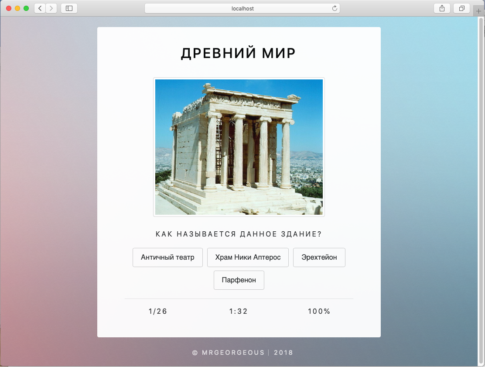
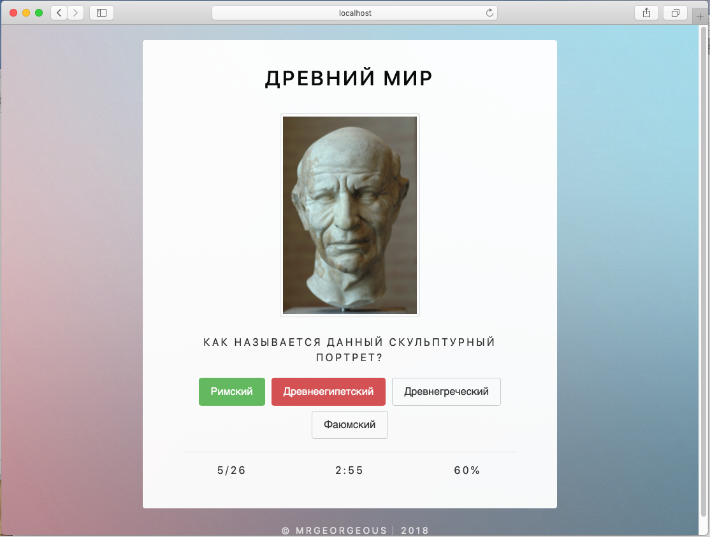
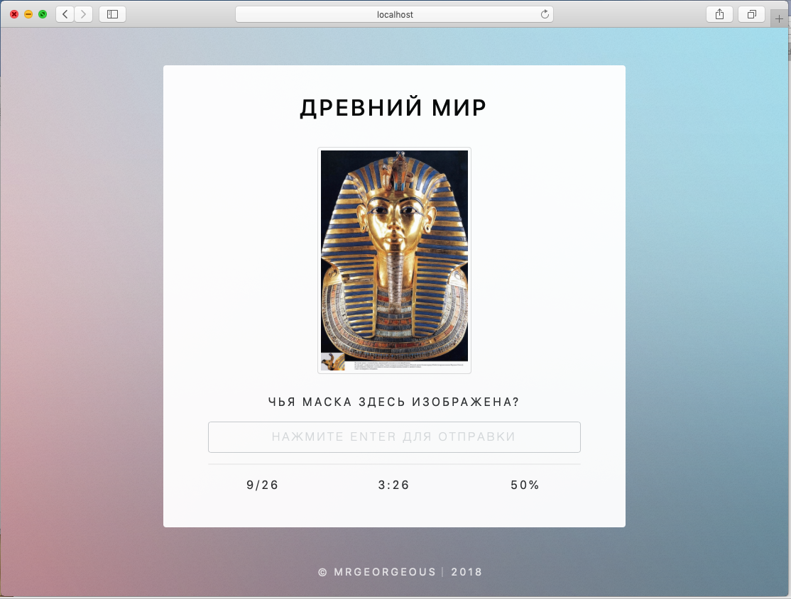
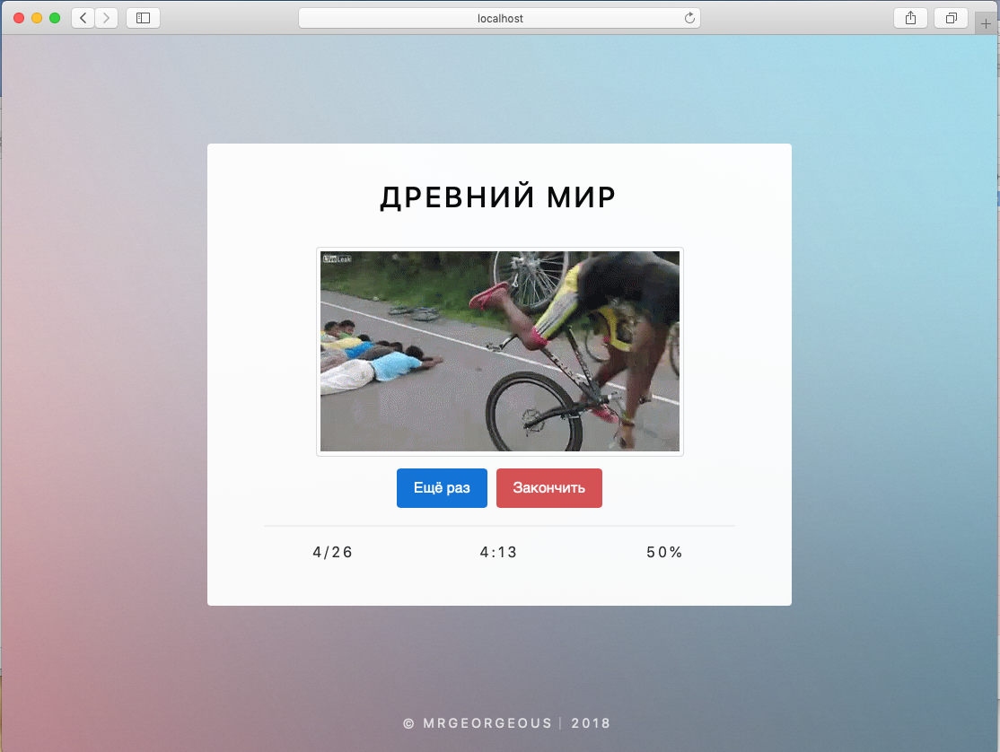
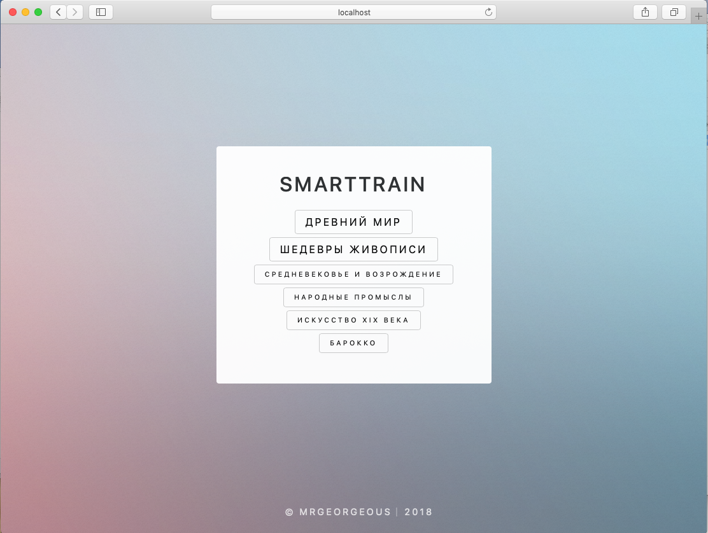
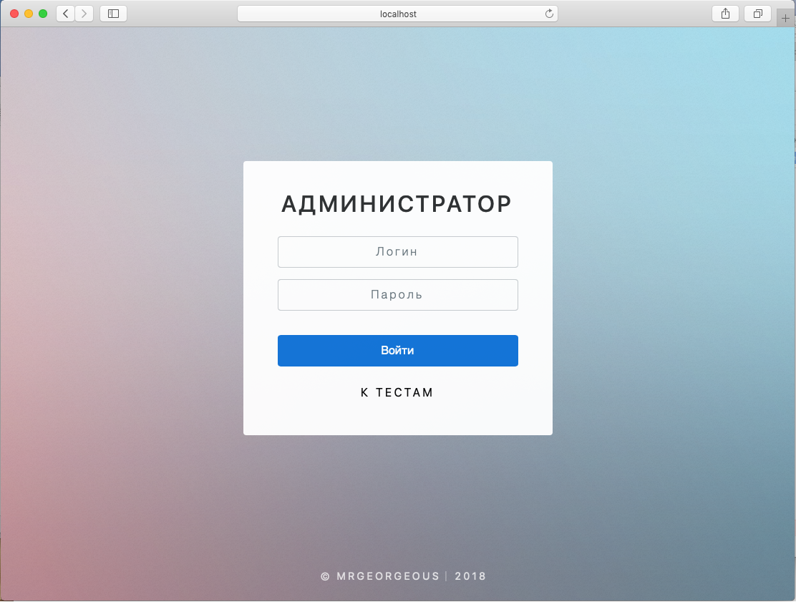
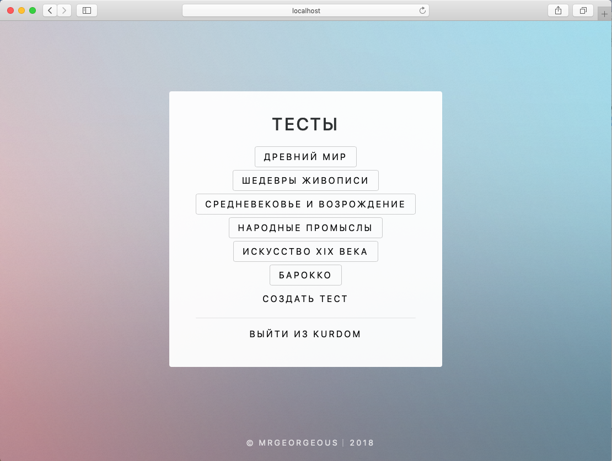
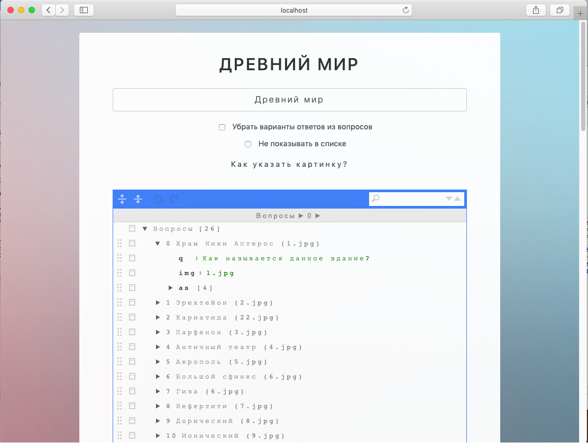

# SmartTrain Web

Web quiz application with multiple answers available and flexible administration.

:closed_book: Security Alert! This application is not maintained. You must not use this application in production before security contributions.

### Introduction

This application was the second product of SmartTrain series released in 2018 (after VB.NET application for Windows in 2015).

SmartTrain Windows & Web versions were used in Lyceum of Science and Engineering. 

### Features

* Test assistance with multiple answers and/or text answers
* Administration page to change visibility, answer types, download images
* After each attempt a GIF corresponding to the result is shown (16 gifs available)

### Screenshots

